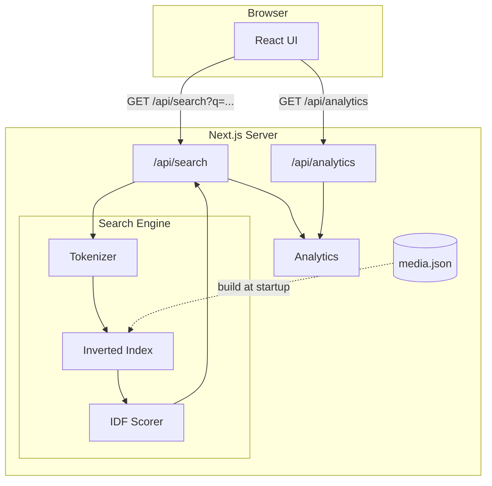

# Media Search - Technical Documentation

## Links

**Link to repository:**

[https://github.com/alexclaes/media-search](https://github.com/alexclaes/media-search)

**Link to deployed solution:**

[https://media-search-hazel.vercel.app/](https://media-search-hazel.vercel.app/)

---

## Architecture Overview

The application follows a standard Next.js architecture with a custom search layer:

```
Browser (React UI) → Next.js App → API Route (/api/search) → Search Index (in-memory)
```



**Key Components:**

- **Frontend**: React components with Tailwind CSS, debounced search input
- **API Layer**: Next.js API routes for search and analytics
- **Search Engine**: Custom in-memory inverted index with IDF scoring
- **Analytics**: In-memory usage tracking (search counts, response times, keywords)

---

## Search Strategy & Relevance

### Tokenization

Text is processed through the tokenizer (`app/lib/tokenizer.ts`):

1. **Lowercase**: All text converted to lowercase
2. **Punctuation removal**: Remove non-word characters, preserving German characters (ä, ö, ü, ß)
3. **German stopwords**: Filter common German words (articles, prepositions, conjunctions)
4. **Minimum length**: Tokens must be at least 2 characters

### Inverted Index

The index structure maps tokens to document IDs per field:

```typescript
interface TokenMap {
  meta: { docCount: number };
  suchtext: { [token: string]: number[] };    // token → doc IDs
  fotografen: { [token: string]: number[] };
  bildnummer: { [token: string]: number[] };
}
```

**Why inverted index?**

- O(1) lookup for exact token matches
- Memory-efficient: tokens stored once, documents referenced by ID
- Easy to extend with new fields

### Field Weights

Different fields have different relevance weights:

### Scoring Algorithm

**IDF (Inverse Document Frequency)** scoring ranks results:

```
Score = Σ (IDF × fieldWeight × similarity)

Where:
- IDF = log(totalDocs / docsContainingTerm)
- similarity = queryTokenLength / matchedTokenLength
```

**Why IDF?**

- Rare terms are more discriminating than common terms
- A document matching "Beckenbauer" (rare) scores higher than one matching "Fußball" (common)
- The similarity factor rewards exact matches over substring matches

### Substring Matching

Query tokens match any indexed token that contains them:

```typescript
const matches = tokens.map(t => allTokens.filter(token => token.includes(t)));
```

**Example**: Query "ball" matches tokens: "Fußball", "Basketball", "Handball"

**Trade-off**: O(n) linear scan through all unique tokens per query term. Acceptable for 10k documents but doesn't scale
to millions.

### AND Logic

Documents must contain ALL query terms (intersection):

---

## Preprocessing (Cold Startup)

All preprocessing happens once at server startup, before any search requests.

### Publication Restrictions Extraction

The `suchtext` field contains embedded publication restrictions:

```
Pattern: PUBLICATIONxINxGERxSUIxAUTxONLY
Extracted: ['GER', 'SUI', 'AUT']
```

The restriction text is stripped from `suchtext` before indexing to avoid polluting search results with non-semantic
tokens.

### Date Normalization

Source dates are in German format (`DD.MM.YYYY`), normalized to ISO format:

### Index Building

At startup, the system:

1. Loads raw media data from JSON
2. For each document:
    - Extracts publication restrictions from `suchtext`
    - Strips restriction pattern from `suchtext`
    - Tokenizes `suchtext`, `fotografen`, `bildnummer`
    - Adds tokens to inverted index with document ID
3. Normalizes all dates
4. Builds a flat array of all unique tokens (for substring matching)

### Updating the Index (New Items)

With the current in-memory solution, new items can be added without a full rebuild:

- Assign the next document ID (current array length)
- Extract and strip publication restrictions from `suchtext`
- Tokenize each searchable field and add tokens to the inverted index
- Normalize the date and append to the dates array
- Add any new unique tokens to the token list for substring matching

```typescript
function addDocument(item: RawMediaItem): void {
  const docId = rawMedia.length;
  rawMedia.push(item);

  // Extract restrictions and clean suchtext
  const {restrictions, cleanedText} = extractRestrictions(item.suchtext);
  publicationRestrictions.push(restrictions);

  // Add tokens to inverted index
  addToFieldIndex(index.suchtext, tokenize(cleanedText), docId);
  addToFieldIndex(index.fotografen, tokenize(item.fotografen), docId);
  addToFieldIndex(index.bildnummer, tokenize(item.bildnummer), docId);

  // Normalize and store date
  normalizedDates.push(normalizeDate(item.datum));

  index.meta.docCount++;
}
```

**Caveat**: This only works within a single server instance. In serverless environments, each instance has its own
index, so updates on one instance won't propagate to others without external coordination (e.g., Redis, database).

## Scaling to Millions + Continuous Ingestion

### Current Limitations at Scale

- **Memory**: 10k items ≈ 50MB; 10M items ≈ 50GB (won't fit in memory)
- **Cold start**: Index build time scales linearly with document count
- **Substring scan**: O(n) per token becomes prohibitive

### Recommended Production Architecture

**For millions of items:**

1. **Elasticsearch/OpenSearch**: Distributed inverted index, horizontal scaling, built-in relevance scoring
2. **Redis**: Cache hot queries, persist index across restarts, share state across instances
3. **PostgreSQL with full-text search**: Alternative for moderate scale with existing Postgres infrastructure

### Continuous Ingestion Strategy

For "new items every minute":

1. **Message Queue (Redis Pub/Sub, SQS, Kafka)**:
    - New items published to queue
    - Background worker consumes and indexes
    - Decouples ingestion from query serving

2. **Incremental Index Updates**:
    - Append new document to raw media array, assign next document ID
    - Tokenize each searchable field (suchtext, fotografen, bildnummer)
    - Add tokens to corresponding inverted index, mapping to the new document ID
    - Normalize and store the date, increment document count
    - Allows adding documents without rebuilding the entire index

3. **Eventual Consistency**:
    - New items available within seconds
    - No blocking of search queries during ingestion
    - Background reindex for optimization (e.g., nightly)

4. **With Elasticsearch**:
    - Built-in near-real-time indexing
    - Bulk API for batch ingestion
    - Refresh interval configurable (default 1s)

---

## Testing Approach

### 1. Manual Testing in Browser

- Explore the search UI to evaluate snappiness and responsiveness
- Test various query patterns: single words, multiple terms, partial matches
- Verify that results feel relevant and appear quickly
- Check filter combinations (date range, photographers) for correct behavior

### 2. Performance Test Script

- Playwright-based browser automation for realistic end-to-end testing
- Fires 500 sequential search queries to measure consistent performance
- Simulates real user behavior by interacting with the actual UI
- Clicks the "Show Analytics" button after completion to display aggregated metrics
- Located in `scripts/performance-test/`

---

## Trade-offs I made

| Decision               | Benefit                  | Cost                               |
|------------------------|--------------------------|------------------------------------|
| In-memory index        | Fast queries (~10ms)     | Cold start penalty, memory bound   |
| Substring matching     | Flexible partial matches | O(n) per token, doesn't scale      |
| Filters before scoring | Better performance       | Slightly more complex code flow    |
| German stopwords only  | Reduces noise            | May over-filter non-German content |